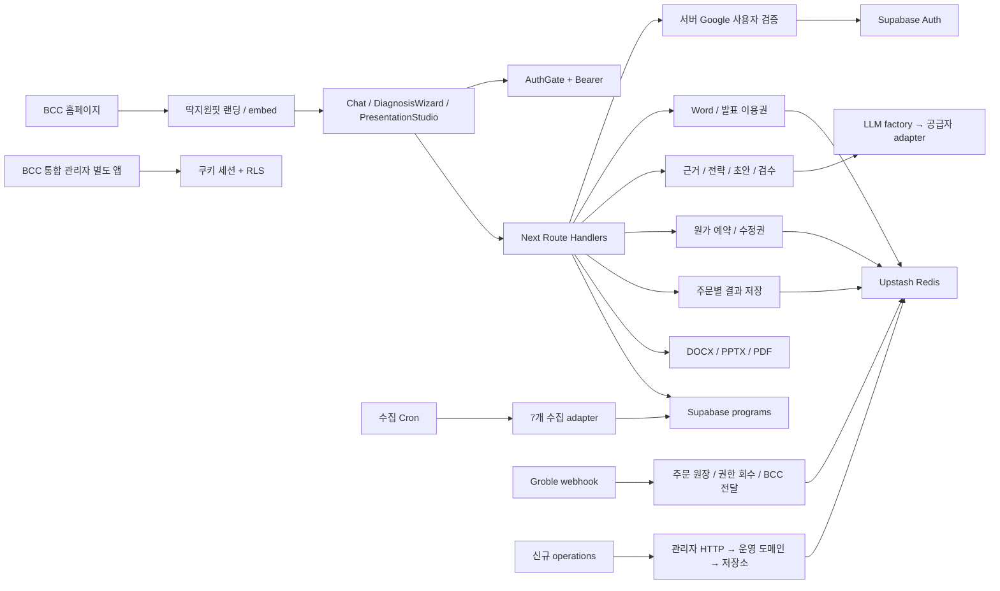
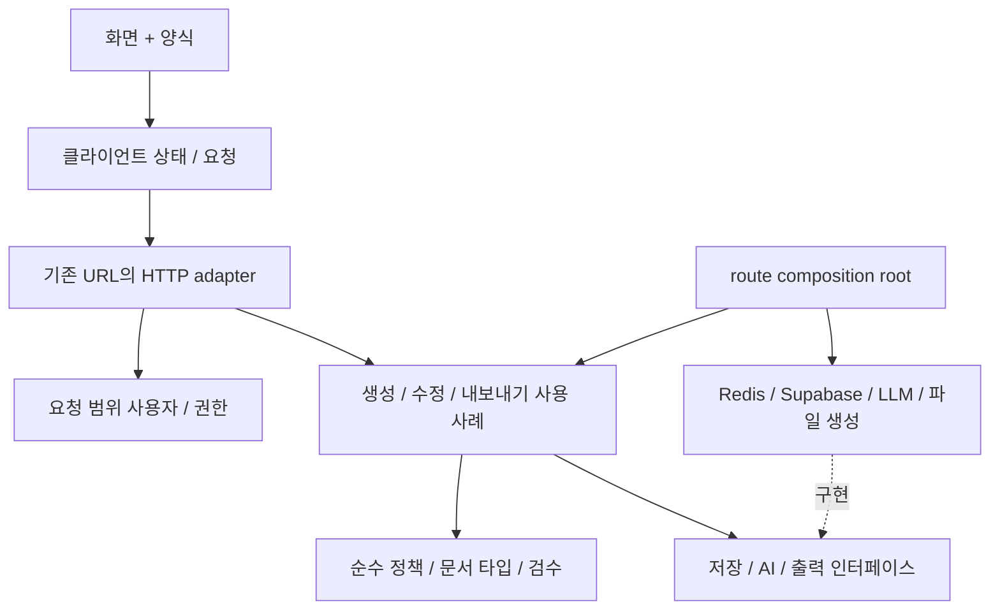

# 딱지원핏 인수인계와 단계별 리팩터링

기준일: 2026-09-17. 대상은 기존 제품 본체와 이 대화에서 추가한 운영 대시보드다. 기능 추가보다 계약 보존과 책임 분리를 우선했다.

## 1. 범위와 정본

| 자산 | 확인 범위 | 이번 변경 |
| --- | --- | --- |
| `~/project/20260614_정부지원사업도우미` | 정본 브랜치 `feat/sources-5-batch-collector`, HEAD `e2ee1f1`, 미커밋 수정 22개 | 원본 파일 변경 없음 |
| `~/ddakfit-operations-20260917` | 위 정본·수정 22개를 보존하고 이전 단계의 운영 모듈을 추가한 작업본 | 이번 리팩터링 적용 위치 |
| `~/project/20260614_딱지원핏/admin` | 패키지·로그인 미들웨어·대시보드 메뉴·Supabase 연결 경계 확인 | 읽기만 수행 |
| BCC 홈페이지·운영 배포 | 공통 개발 지도와 관련 기록에서 연동 관계 확인 | 배포 상태를 새로 조회하거나 코드를 변경하지 않음 |

이 대화에서 확정한 범위는 기존 제품 보강이다. 운영 화면은 월 100만원·2026-09-30 목표를 위한 수동 기록 도구이며, 홈페이지 로그인 후의 통합 관리자 메뉴에는 아직 연결되지 않았다. 새 자동 수집·자동 게시·새 로그인 시스템을 완료한 것으로 취급하지 않는다.

현재 대화, 공통 원본, 개발 지도, 지금 할 일, 2026-09-01 제품 흐름 기록과 실제 소스를 대조했다. 계정의 모든 과거 대화 원문을 전수 읽었다는 의미는 아니다. 과거 배포 승인은 이번 배포 승인으로 사용하지 않았다.

통합 관리자 미들웨어는 로그인 여부를 확인하고 데이터 권한은 별도 RLS 등에 의존한다. 이번에 운영 RLS 정책을 조회하지 않았으므로 관리자만 접근 가능하다고 새로 보증하지 않는다. 향후 홈페이지 연결은 메뉴 추가, 대상 도메인의 로그인 복귀, 서버 관리자 권한 확인을 함께 검증해야 한다. 같은 Supabase 프로젝트를 쓴다는 이유만으로 도메인 간 자동 로그인이 완성되는 것은 아니다.

## 2. 모듈 경계와 의존성

분석 시작 시 `app/components/lib`의 TS·TSX 135개, 내부 import/export·문자열 dynamic import 간선 364개, API route 40개를 확인했다. 파일 마지막 빈 줄을 제외한 동일 기준에서 `Chat.tsx`는 4,672줄이다. 컴포넌트 파일 전체에 useState 88회와 useEffect 11회가 있으며 중첩 하위 컴포넌트 호출도 포함한다.

| 모듈 | 현재 책임 | 경계 문제·유지할 계약 |
| --- | --- | --- |
| `app/landing`, `/embed`, `components/chat` | 유입·로그인·공고 선택·문진·결제·초안·출력 | Chat에 흐름과 I/O·저장이 집중. URL·버튼·복원 동작 보존 필요 |
| `lib/match`, `lib/data`, `lib/supabase/programs` | 7개 원천 수집, 정규화, 활성 공고 조회, 규칙 매칭 | 수집의 완전성·공고 종료 판정과 사용자 요청을 분리해야 함 |
| `lib/auth`, `components/auth` | Google 사용자 확인, 관리자 판단, 클라이언트 세션 | 본체 Bearer 인증과 통합 관리자 쿠키 인증은 다른 경계 |
| `lib/plan/paidAccess`, `presentationAccess` | 주문·상품·공고 이용권 | 인증·결제·저장 코드 혼재, 공고 바인딩 원자성 보강 필요 |
| `app/api/plan/*` | 요청 파싱·권한·원가·프롬프트·AI·저장·응답 | HTTP 어댑터와 사용 사례 조정이 섞임. 일괄 API 재작성은 위험 |
| `lib/plan/strategy`, `reviewer`, `presentation` | 근거·계획·미확인 구분, 검수, 발표 구조 | 문서 데이터 타입이 DOCX 렌더러에 묶여 있었음 |
| `lib/plan/docx`, `presentationExport`, `lib/viz` | 실제 DOCX/PPTX/PDF·PNG 출력 | 출력 서식·근거 digest·파일 헤더는 외부 계약 |
| `lib/llm` | 공급자 선택, 스트림·JSON 변환, 검색 | factory와 adapter가 타입을 통해 순환. JSON Schema 보장 주석과 실제 동작 차이 |
| `lib/operations`, `app/operations` | 목표·누적 성과·영상 계획·다음 행동 | 초기 화면 721줄에 입력·요청·상태가 혼재. 이번에 분리 |

전체 파일 그래프: [변경 전](dependency-graph.before.json), [변경 후](dependency-graph.json). `npm run report:architecture`로 재생성한다. 이 그래프는 정적 리터럴 의존성이고, 동적으로 조립한 모듈명·외부 서비스 내부·번들 최적화 결과까지 증명하지 않는다.

시작 시 강연결 묶음은 `llm/provider → openai/anthropic → provider` 1개였다. adapter의 역방향은 `import type`이므로 **실행 코드 순환은 0개**였다. 이번 타입 분리 후 명시적 타입 참조까지 포함한 순환도 0개다. 타입 순환을 런타임 장애로 과장하지 않는다.

## 3. 데이터 흐름과 핵심 실행 경로

### 무료 탐색 → 유료 Word

1. `/embed`의 AuthGate가 Google 세션을 복원한다. 클라이언트는 요청 직전 fresh token을 읽는다. API에서 다시 사용자·권한을 확인한다.
2. 공고 탐색은 `/api/match` → Supabase 활성 공고 → 업력·지역·유형 규칙이다. 사업 설명의 AI 처리는 정렬에 사용하며 추천 건수를 바꾸지 않는 가드가 있다.
3. 공고·양식 첨부 → `/api/files/extract` → `/api/plan/fitcheck`. 화면은 텍스트 스트림과 `[자격요건]`, `[작성요약]`, `[제출유형]` 등의 표식을 해석한다.
4. Groble 결제 원장과 `/api/order/verify`를 통해 계정별 Word 이용권을 연결한다. 무료 통계 이벤트와 실제 결제는 구분한다.
5. 문진 → `/api/plan/evidence` → `/strategy` → `/draft-batch` → `/audit`. 단계별로 이용권·공고, AI 원가, 사용자 원답변·근거를 확인한다. 일부 실패는 `degraded` 검토 결과로 복구한다.
6. `/api/plan/docx`는 최신 sections/evidence/strategy digest와 확인 사항을 검사하고 실제 DOCX를 생성한다. 최초 최종 제공을 기록하며 30일 수정 기간이 시작된다.
7. `/api/plan/revise`는 수정권·원가를 예약하고 성공 결과를 반환한다. 예외 경로는 예약을 복구한다. 이번 공통 서비스 분리는 이 순서를 바꾸지 않았다.

### Word → 발표

발표 API는 Word 권한과 발표·묶음 상품 권한을 별도로 확인한다. 원답변·근거·전략·최종 Word에서 발표 주장 장부를 만들고 추가 질문, 생성, 검수를 수행한다. 저장된 결과의 digest와 동의·검수 상태를 확인한 뒤 PPTX/PDF를 내보낸다. 발표 수정 정책은 30일/2회이며 Word의 3회와 구분된다.

### 매출 운영

`OperationsDashboard → useOperationsDashboard → GET/PUT /api/operations → 서버 관리자 확인 → parseMutation/applyCommand/summarize → OperationsStore` 순서다. 월 문서의 revision을 Redis EVAL로 비교 저장한다. 개발 전용 파일 저장소는 별도이며 실제 주문·고객 문서를 읽지 않는다. 매출과 조회수는 운영자가 확인해 입력하며 실매출 자동 집계는 없다.

## 4. 상태와 원본 소유권

| 상태 | 저장·수명 | 실제 소유자 | 주의점 |
| --- | --- | --- | --- |
| 로그인·paid·admin UI | AuthGate React Context | 인증 서버가 권한 원본 | UI 값만으로 서버 권한을 열지 않음. 로그인 시 order verify GET 부작용 존재 |
| 문진·선택 공고·초안·근거·심사·진행 단계 | Chat의 useState 다수 | 진행 중에는 브라우저 | mode와 busy 플래그 조합으로 불가능한 상태를 표현할 수 있음 |
| `govplan_convos_v1` | localStorage 대화 목록 | 해당 브라우저 | 사용자 ID 네임스페이스·스키마 마이그레이션 없음. 계정 교체 복원은 별도 검증 필요 |
| `gp_selprog_v1`, `gp_find_v1`, `gp_plan_output_v1` | sessionStorage | 해당 탭 | 결과·대화가 다른 키에 있어 복원 시 일치 검사 필요. 용량 초과는 조용히 무시 |
| Word·발표 이용권 | `gp:paid:*`, `gp:presentation-paid:*` | 서버 | 권한과 사용자별 현재 주문이 연결됨. 과거 주문 취소 시 현재 주문 대조 필요 |
| 근거·전략·심사·발표 | 주문별 Redis 객체, 45일 TTL | 서버 | Application ID 대신 주문과 현재 사용자 연결로 조회. 관리자 fallback은 사용자별 공간 |
| 수정권·최초 제공 | 상품별 delivery/count 키 | 서버 | NX 최초 시점·상품별 횟수·30일 만료 유지. 프로세스 장애 후 미정산 예약은 후속 과제 |
| AI 원가 | 주문별 INCRBY 예약·정산, 최근 로그 | 서버 | 선예약은 원자적 증가지만 분산 lease가 없어 중단 후 복구·정산 재시도 취약 |
| 운영 목표·누적 성과 | 월별 JSON + revision, TTL 없음 | 승인 관리자 | 0과 null 구분, 누적값 합산 금지, 최대 100개 영상·최근 100개 변경 |

## 5. 위험도·수정 비용 우선순위

아래 비용은 한 개발자의 순수 구현·검사 예상치이며 외부 계정·제공자 확인 대기는 제외한다. P0는 다음 운영 배포 전에 다뤄야 할 데이터/결제 위험, P1은 다음 구조 개선, P2는 점진적 유지보수다. 사고 발생이 확인됐다는 뜻은 아니다.

| 우선 | 관찰된 문제와 근거 | 영향 | 비용 | 처리 |
| --- | --- | --- | --- | --- |
| P0 | [webhook](../../app/api/groble/webhook/route.ts)의 취소 분기가 orderused의 사용자로 현재 paid 키를 삭제하며 현재 orderNo를 대조하지 않음 | 주문 A 후 B 재구매, 늦은 A 취소가 B 권한에 영향을 줄 수 있음 | 1~2일 | 공식 이벤트 fixture·역순 전달 검사 후 조건부 원자 회수. 이번엔 변경하지 않음 |
| P0 | 같은 webhook이 취소가 아닌 유효 번호 이벤트를 등록으로 처리하고 전체 본문 문자열로 취소를 추정 | 새 이벤트·역순/중복 전달 시 원장 오분류 가능 | 2~3일 | 제공자 event ID·상태 전이 계약 확정 후 허용 이벤트 목록·멱등 원장 |
| P0 | [paidAccess](../../lib/plan/paidAccess.ts)와 [presentationAccess](../../lib/plan/presentationAccess.ts)의 공고 바인딩이 GET→SET | 서로 다른 공고의 동시 시작 시 한 이용권으로 두 작업 진행 가능성 | 1~2일 | expected order + 미바인딩 조건 CAS, 2공고 경합 검사 |
| P1 | [Chat](../../components/chat/Chat.tsx) 4천 줄 이상, 화면·문진·결제·파일·저장·네트워크 혼재 | 복원·재시도 변경이 다른 흐름에 영향을 줌 | 4~7일, 단계 분할 | 순수 목차 파서만 이번에 추출. checkout/document-generation/persistence부터 순차 분리 |
| P1 | [AuthGate](../../components/auth/AuthGate.tsx) 로그인 시 `/api/order/verify` GET, 해당 GET은 최근 주문 claim 가능 | 조회·인증·구매 연결의 책임 혼재. 운영 화면에도 불필요한 주문 조회 | 1~2일 | 새 읽기 전용 세션/권한 API → 클라이언트 전환 → 기존 GET 호환 유지 |
| P1 | [googleUser](../../lib/auth/googleUser.ts)와 paid access 경로를 중복 호출하는 route 다수 | 같은 요청에서 원격 인증 반복, 오류 처리 차이 | 1~2일 | 요청 범위 인증 컨텍스트. 사용자 간 공유 캐시 금지, master/QA 예외 고정 |
| P1 | Word/발표 수정권 알고리즘 중복 | 상품 한쪽만 수정되는 정책 편차 위험 | 0.5~1일 | **이번 공통 서비스 분리 완료**, 30개 전후 계약 fixture 비교 |
| P1 | 수정권·[AI budget](../../lib/plan/aiBudget.ts)의 메모리 settled 플래그·사후 복구 | 서버 중단 또는 정산 실패 시 차감이 남고 재시도 어려움 | 2~4일 | 예약 ID·만료·정산 멱등성 도입. 이번 추출은 이 동작을 개선한 것으로 주장하지 않음 |
| P1 | 브라우저 복원 데이터가 계정/작업 ID로 구조화되지 않음 | 공용 기기 계정 변경, 재구매, 오래된 탭에서 작업 혼선 | 2~3일 | 계정별 v2 저장소 + v1 읽기 어댑터 + 로그아웃/복원 회귀 검사 |
| P1 | 기존 image-size/pptxgenjs 감사 high 2건 | 문서 생성 의존성 위험 | 0.5~2일+패치 확인 | 이전 검사 결과 유지. 서버 생성 PNG 제한 유지, 별도 업그레이드 검증 |
| P2 | LLM factory를 adapter가 타입으로 역참조 | 교체·테스트 경계 불명확 | 0.5일 | **types.ts로 분리 완료**, 기존 provider 타입 재수출 유지 |
| P2 | LlmClient.json 주석은 스키마 검증을 약속하지만 adapter는 파싱만 수행 | 호출자가 검증을 잘못 신뢰할 수 있음 | 1~2일 | 주석을 실제 동작으로 정정. 런타임 validation 도입은 기존 응답 fixture 후 별도 변경 |
| P2 | 데이터 타입이 [DOCX renderer](../../lib/plan/docx.ts)에 존재 | UI·검수·발표가 출력 어댑터를 타입 원본으로 참조 | 0.5일 | **documentTypes.ts로 분리 완료**, 기존 타입 이름·경로 호환 유지 |
| P2 | Redis 생성 helper 15곳 + 운영 전용 adapter | 타임아웃·재시도·오류 규칙 드리프트 | 1~2일 | 일괄 singleton 통합하지 않음. fail-open/closed와 옵션을 먼저 분류 |
| P2 | 운영 화면 721줄의 입력·요청·상태 혼재 | UI 수정과 요청 수정의 영향 범위 증가 | 0.5일 | **Forms + hook + 화면 분리 완료** |
| P2 | 기존 제품 검사의 일부가 소스 정규식 검사 | 문구·구현 위치 변경에 취약, 실제 I/O 실패를 놓침 | 2~3일 | 기존 검사는 유지, 이번에 외부 응답·저장 동작 기반 계약 검사 추가 |

## 6. 목표 구조와 이행 순서

당장은 Next.js 단일 서비스를 유지한다. 저장소·도메인·HTTP를 분리하되, 전체 코드를 이동하거나 범용 BaseRepository를 도입하지 않는다. 필요가 확인된 사용 사례에만 작은 인터페이스를 둔다.

| 단계 | 변경 단위 | 다음 단계 진입 기준 | 되돌리기 |
| --- | --- | --- | --- |
| 0 기준선 | 원본·미커밋 보존, 그래프, 응답/저장 fixture | 이번 시작 소스 snapshot 및 30개 수정권 관찰 기록 확보 | 코드·DB 변경 없음 |
| 1 의존성 경계 | 타입 분리, 공통 수정권, 목차 파서, 운영 UI 책임 분리 | 35개 신규·37개 운영 검사, 기존 가드·타입·빌드, 경계 검사 | 이번 변경만 되돌림. DB 키·API·마이그레이션 변경 없음 |
| 2 결제 정합성 | webhook parser와 주문 전이 서비스 분리, 공고 CAS | A/B 재구매·역순취소·중복·동시 claim 테스트, 제공자 계약 fixture | parser/전이별 변경 분리. 새 원장은 기존 키와 대조한 뒤 전환 |
| 3 인증/조회 | 요청 컨텍스트·읽기 전용 권한 조회 | 401/402/403·master·QA 동작·로그아웃 동일, 인증 요청 수 감소 | 기존 API facade 유지, 호출자별 순차 전환 |
| 4 고객 상태 | Chat에서 결제 복귀·문서 생성·저장소 hook 추출 후 reducer | 새로고침·만료토큰·취소·실패 재시도·v1 저장 복원·두 탭 검사 | 기능별 adapter 교체, v1을 즉시 삭제하지 않음 |
| 5 작업/수집 | Application ID·예약 ledger·읽기 전용 통계 연동 | AI 실패/중단 재실행, 수동/자동 수치 대조, 복구 리허설 | 새/기존 조회 대조, 데이터 이전은 별도 승인된 배포 단위 |

단계 1을 이번 코드에 적용했다. 나머지는 완료된 것으로 표시하지 않는다. 2단계 이후의 안전한 변경을 위한 테스트 경계를 마련한 것이다.

## 7. 외부 계약 보존 목록

- 모든 기존 API URL·method, JSON 필드, 상태 코드, 텍스트 스트림 표식을 유지한다. 비로그인 오류 401과 기존 유료 관문의 402를 통일하지 않는다.
- Word 29,900원·발표 19,900원·묶음 44,900원, 상품 ID·결제 URL·master/QA 판정을 변경하지 않는다.
- 기존 수정 함수의 export 이름과 기본 인자를 유지한다. Word `gp:delivery:*`/`gp:revision-count:*`, 발표 별도 접두사, 최초 NX, `< now` 만료 경계, 횟수 3/2를 유지한다.
- `provider.ts`와 `docx.ts`에서 기존 타입을 재수출해 외부 호출자의 import 경로를 유지한다.
- 문서 bytes 생성 로직·파일 헤더·digest·45일 TTL·공고 수집 정책을 변경하지 않는다.
- 운영 GET/PUT과 nullable 수치·revision 계약, 로컬 파일 경로·원래 기록을 유지한다.

시작 소스를 같은 TypeScript 설정으로 변환해 비교했을 때 API route 40개의 실행 코드와 수정권 외 기존 라이브러리 실행 코드가 동일했다. 이는 계약 보존의 정적 근거이며 실결제·AI·외부 저장소 E2E를 대체하지 않는다.

## 8. 인수받은 개발자의 첫 확인

`npm run check:architecture`, `npm run test:refactor`, `npm run test:operations`, `npm run test:guards`, 타입 검사와 빌드를 먼저 실행한다. 새 컴포넌트에서 서버 저장소/SDK를 직접 가져오지 않는다. 공통 타입 파일에 factory import를 추가하지 않는다.

단순 `git diff HEAD`에는 이번 리팩터링 이전의 제품 품질 수정 22개도 포함된다. 이번 전후 비교는 [변경·검증 기록](refactor-verification.md)을 기준으로 검토한다. 원본 저장소의 기존 변경을 이번 결과로 덮어쓰지 않는다. 홈페이지 통합 관리자 연결과 운영 배포는 여전히 별도 작업이다.
