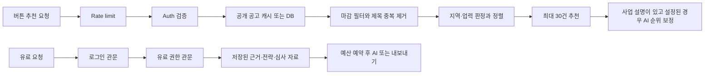

# 딱지원핏 성능 조사·최적화·검증

2026-09-17. 현재 작업본의 실제 함수를 측정하고 네 곳을 수정했다. **운영 배포는 하지 않았다.** 운영 트래픽·분산 추적 자료가 없으므로 아래 순위는 호출 경로의 적용 범위와 로컬 증거에 따른 작업 우선순위다. 운영 환경에서 가장 느린 요청을 확정한 순위는 아니다.

사용자가 선택한 이번 범위는 **서버 측정부터 완료**다. 화면 잠금으로 브라우저 측정이 불가능했고, 이후 사용자 선택에 따라 렌더링 수정은 진행하지 않았다.

## 1. 비용 분해와 검증 가능한 가설

| 자원 | 실행 경로·비용 | 가설과 반증 기준 | 이번 증거·상태 |
|---|---|---|---|
| CPU | 공고 마감 필터 → 제목 정규화·중복 제거 → 지역·업력 판정 → 정렬 → 최대 30건 반환 | 지역 판별식의 반복 생성이 지역 선택 요청의 주요 CPU 비용이다. 판별 결과를 유지하며 생성 횟수를 0으로 만들면 같은 입력의 CPU 시간과 p95가 감소해야 한다. | 3,000행/부산 선택에서 66,008회 → 0회. 3개 프로필을 순환한 90회 측정 CPU 1,397.15 → 452.00ms. 수정 완료. |
| 메모리 | 공고 배열·문자열, 정렬용 객체, `structuredClone`, JSON 응답·AI 프롬프트·이미지 버퍼 | 불필요한 객체 생성 감소가 전체 힙 감소와 같지는 않다. 동일 입력에서 생성 횟수, GC 후 잔존 힙, RSS/외부 버퍼를 분리해서 확인한다. | 판별식·후보 배열 생성 제거. 3,000행 측정 중 샘플링한 힙 증가량은 오히려 37.91 → 51.64MB. 전체 메모리 절감은 입증하지 못함. |
| I/O | 공고 수집·파일 추출, 폰트 확인·로딩, DB 임시 정렬, 파일 내보내기 | 넓은 행의 정렬이 메모리를 넘으면 임시 파일 I/O가 발생한다. 동일 SQL에서 정렬을 지원하는 인덱스로 spill이 사라지는지 확인한다. | 로컬 Postgres 10만 행에서 external merge 정렬 확인. 부분 인덱스 후 Sort·임시 블록 읽기/쓰기 제거. 운영에는 미적용. |
| 네트워크 | Supabase Auth, PostgREST, Redis, AI 공급자, 자료 다운로드 | 같은 요청의 로그인 관문과 유료 접근 관문이 인증을 중복 조회한다. 인증 호출을 2 → 1로 줄여도 권한 판정은 같아야 한다. | 실제 관문 함수를 고정 20ms 모의 전송으로 실행: p95 44.06 → 22.87ms. 서로 다른 요청은 계속 검증. 수정 완료. |
| DB | 공고 목록 1회 조회, 500행 단위 수집 upsert, 유료 권한·자료 Redis 조회 | `SELECT *`로 받아 버리는 컬럼이 전송·파싱 비용을 만든다. 조회 컬럼을 줄인 뒤 `Program[]` 결과 해시가 같아야 한다. | 설치된 Supabase SDK와 합성 응답으로 1,941,716 → 1,597,826 bytes, 결과 동일. 수정 완료. DB 실행시간 개선으로 해석하지 않음. |
| 렌더링 | 채팅 스트림 조각 → `replaceLast` → 메시지 갱신 → 대화 저장 효과 → 대화 목록 갱신. 서버 PDF는 SVG 래스터화. | 브라우저에서는 조각 수에 비례한 전체 대화 직렬화·재렌더가 입력을 방해할 수 있다. React commit 수/시간·긴 작업·저장 횟수를 같은 스트림에서 비교해야 한다. | 브라우저 미측정·미수정. 별도 Node 합성 대화 직렬화와 서버 래스터화만 측정. |

단위를 구분한다. 함수 처리시간은 HTTP 응답시간이 아니며, 모의 응답 대기시간은 실제 네트워크 왕복시간이 아니다. 힙은 V8 메모리이며 네이티브 이미지 버퍼·DB 메모리·전체 프로세스 RSS를 대신하지 않는다.

## 2. 호출 경로와 복잡도·N+1 조사



- `dedupePrograms`: 이미 `Map` 사용. 제목 전체 문자 수를 L이라 하면 정규화 O(L), N개 키 조회는 평균 O(N). O(N²) 중복 탐색이라는 가설은 기각했다.
- `matchByButtons`: 지역·업력 판정은 문자 길이에 의존하고, 통과한 M건을 정렬하므로 O(M log M). 기존 `selected.includes`의 대상은 최대 30건, 신규 소스 반복은 5개 고정이라 이 부분을 N²라고 부르면 잘못이다. 지역 보장·소스 보장·동점 순서를 보존했다.
- 기존 지역 판정은 공고마다 후보 배열과 최대 24개 정규식을 생성했다. 수정 후 고정 25개를 모듈 로딩 때만 만들고, 사용자 지역에 속한 식은 실행 시 건너뛴다. `g`/`y` 플래그가 없어 반복 호출의 `lastIndex` 영향이 없다. 전체 정렬 복잡도는 그대로이고 상수 비용을 줄였다.
- 무료 공고 조회는 `getOpenPrograms` 한 번이다. 추천 카드마다 DB를 다시 읽는 N+1은 확인되지 않았다. `.limit(3000)`은 요청 상한이며, 실제 반환 수는 서버의 최대 행 설정에도 영향을 받는다. 1만 행 CPU 실험은 미래 확장 시나리오이고 현재 API가 1만 행을 가져온다는 뜻이 아니다.
- 수집 저장은 `before` 조회 1회 + `ceil(N/500)`번 upsert + 전체 수집 소스에 한해 종료 처리 1회다. 개별 행마다 쓰는 N+1 구조가 아니다. 수집 비용·호출 제한 때문에 이 배치를 무제한 병렬화하지 않았다.
- Word 내보내기는 `getAuditArtifact`, `getEvidencePack`, `getStrategyPack`를 `Promise.all`로 호출한다. 각 함수가 주문 조회 1회 + 자료 조회 1회를 수행하므로 자료 로딩 부분만 Redis GET 6회, 보통 두 단계 왕복이다. 이는 **고정된 중복 주문 조회**이며 공고 수에 따라 늘어나는 N+1과 구별해야 한다. 발표자료 내보내기도 고정된 4개 자료 로딩이다.
- 결제 상태와 자료의 주문 연결은 캐시하지 않았다. 새 결제·이용권 바인딩·취소와의 일관성을 먼저 정의한 뒤, 한 요청에서 주문 번호를 확정하고 자료를 묶어 읽는 변경을 별도로 검증해야 한다.
- 버튼 추천에서 `bizDesc`가 있고 공급자 설정이 유효하면 AI 순위 보정이 추가된다. “버튼 추천은 언제나 AI 호출 0회”라고 단정할 수 없다. AI 포함 요청은 규칙만 사용하는 요청과 분리해 지연시간·비용을 집계해야 한다.
- 서버 소스의 동기 파일 I/O 검색에서는 `font.ts`의 최초 경로 확인 `existsSync`가 확인됐다. 폰트 경로는 이미 단일 Promise로 재사용한다. 문서 래스터화의 `async svgToPng` 내부 `new Resvg(...).render().asPng()`는 동기 CPU/네이티브 처리이며 `async` 선언만으로 실행이 분산되지 않는다.

## 3. 영향도 순 조치: 기준 → 원인 → 수정 → 벤치마크

| 순위 | 대상·측정 기준 | 원인·수정 | 비교 결과와 적용 상태 |
|---|---|---|---|
| 1 | 유료 관문의 Auth 왕복 수/지연 | 동일 `Request`에 대해 검증 결과를 공유하는 `WeakMap`. 헤더 변경·제거 시 무효화, 최대 5초, 실패는 보관하지 않음. 반환 객체는 복사해 호출자 변경을 격리. | Auth 2 → 1회/요청. 모의 20ms 전송에서 p95 44.06 → 22.87ms. 코드 적용. 결제 권한 Redis 조회는 유지. |
| 2 | 공고 추천 CPU/p95/객체 생성 | 지역 후보·정규식을 공고마다 재생성하던 코드를 고정된 모듈 상수로 이동. | 3,000행 p95 23.85 → 6.27ms, 약 73.7% 감소. 정렬·추천·입력 데이터 불변 검사 통과. 코드 적용. |
| 3 | 공고 DB 전송량·정렬 I/O | `SELECT *`를 `fromRow`에서 실제 쓰는 10개 컬럼으로 축소. `closed_at IS NULL` + 마감일 정렬을 지원하는 부분 인덱스를 로컬에서 검증. | 합성 응답 17.7% 축소. 조회 컬럼 코드 적용. DB 인덱스는 **실험/후보 SQL만**, 운영 적용 전 실행 계획 확인 필요. |
| 4 | 캐시 갱신 직후 Redis read 수 | 다른 인스턴스의 결과를 받아온 두 분기에서 `localUntil` 갱신 누락. `promote`로 공통 처리하고 freshness 상한 유지. | 경합 후 20번 읽을 때 추가 Redis read 1 → 0회. 최초 획득까지 포함한 read 3 → 2회. 공개 공고 캐시를 켠 환경에서만 적용되는 수정. |
| 5 | PDF 내보내기 동기 점유 | 1600×900 합성 SVG와 번들 폰트 래스터화의 p95 12.57ms/장. 여러 장·동시 요청에서 메인 실행 흐름 점유가 누적될 수 있음. | 측정만 진행. 다음 수정은 설치된 라이브러리의 비동기 렌더 또는 기존 큐 연결을 실제 문서 결과와 대조. CPU 총량 감소·PDF 전체 지연 감소를 아직 입증하지 않음. |
| 6 | 캐시 복제·직렬화 | 공개 공고 반환 때 3,000행을 복제. 합성 데이터 `structuredClone` p95 2.02ms. 대화 50개 × 메시지 20개의 JSON 약 1.05MB. | 기존 복제 격리를 보존. 일반 JSON 직렬화 p95 0.36ms는 Node 결과이며 브라우저 저장 시간은 포함하지 않음. 추가 최적화는 프로파일 후 결정. |
| 별도 | 브라우저 중복 갱신·저장 | 4개 스트림 소비 루프가 조각마다 상태를 갱신하고 자동 저장 효과가 전체 대화 목록을 직렬화. | 사용자 선택에 따라 브라우저 계측·수정은 다음 단계. 실제 commit 수·입력 지연 개선값 없음. |

Auth의 5초 제한은 같은 요청 안에서만 적용된다. 서로 다른 HTTP 요청은 토큰이 같아도 새로 검증한다. 같은 요청 중 계정 상태 변경을 즉시 다시 확인해야 하는 새 기능을 추가한다면 검증 경계를 별도로 두어야 한다. 주문 상태는 이 캐시에 들어가지 않는다.

공개 공고 캐시는 앞선 100배 설계의 `PROGRAM_CACHE_ENABLED=on`일 때만 동작하며 기본은 꺼져 있다. 이번 수정으로 운영 설정을 변경하지 않았다. 기존 `fresh/stale` 수명·lease·실패 시 backoff·호출자별 복제 정책을 유지했다.

## 4. 수치와 재현 조건

Node v24.14.1, Apple M4 Pro, macOS arm64. 실제 TypeScript 소스를 테스트 VM에서 읽어 컴파일한 뒤 실행했다. 모듈 로딩·컴파일은 측정 구간에서 제외했다. 테스트 전송 외 실제 Auth·고객 데이터·AI·결제는 호출하지 않았다.

`tests/fixtures/performance-before/`에는 이번 수정 직전 소스 6개의 원문과 SHA-256 manifest가 있다. 확장자를 `.source`로 저장해 앱 빌드에 포함하지 않는다. 이전 리팩터링/100배 설계 변경이 이미 들어 있는 상태를 기준으로 삼았으며, Git HEAD를 이번 성능 수정 전 기준으로 오인하지 않는다.

| 합성 공고 수 | 수정 전 p50 / p95 | 수정 후 p50 / p95 | 반복 |
|---:|---:|---:|---:|
| 300 | 1.82 / 2.59ms | 0.48 / 0.62ms | 워밍업 30, 측정 90 |
| 3,000 | 17.89 / 23.85ms | 4.44 / 6.27ms | 워밍업 30, 측정 90 |
| 10,000 | 59.76 / 78.36ms | 14.64 / 17.97ms | 워밍업 30, 측정 90 |

매칭은 부산/경기/전국의 3개 프로필을 순환한다. 3,000행 입력의 SHA-256 및 마지막 출력 해시는 전후 동일하고, 별도 회귀 검사에서 5개 크기 × 3개 프로필의 전체 결과와 순서도 비교한다. 한 쌍의 프로세스 실행 결과이므로 운영 배포 판단에는 아래 반복 측정 절차를 추가한다.

Auth는 워밍업 5 + 측정 40 요청. 45개의 서로 다른 Request에 각각 로그인 관문과 유료 접근 관문을 실행하여, 원격 Auth 호출 90 → 45회와 유료 권한 읽기 45회 유지를 확인했다. 실제 Supabase 서버의 지연 분포·재시도 비용은 측정하지 않았다.

Supabase 컬럼 실험은 **설치된 SDK가 실제 PostgREST URL을 만들고 모의 전송이 컬럼을 선택해 응답**한다. 실제 HTTP 압축·DB 실행시간은 포함하지 않는다. 합성 테이블에 `external_id`, `first_seen_at`, `last_seen_at`, `closed_at`을 추가해 버려지는 컬럼을 재현했다. 실제 테이블의 평균 행 크기와 절감률은 다를 수 있다. SDK+모의 전송 단발 시간은 오히려 14.48 → 16.64ms였으므로 DB 응답이 빨라졌다고 주장하지 않는다.

### 실제 PostgreSQL 실험

격리된 로컬 PostgreSQL 17.11의 TEMP 테이블, 전체 100,000행 중 20,000행 활성, 요청 LIMIT 3,000. 변형별 워밍업 1 + `EXPLAIN (ANALYZE, BUFFERS, FORMAT JSON)` 5회. 인덱스 외 쿼리는 같다.

| 항목 | 인덱스 전 | 부분 인덱스 후 |
|---|---:|---:|
| 실행시간 중앙값 | 14.606ms | 1.564ms |
| 주요 실행 경로 | Seq Scan → Sort → Limit | Index Scan → Limit |
| 첫 측정의 임시 정렬 공간 | 10,576KB, external merge | Sort 없음 |
| 첫 측정 Temp Read / Written Blocks | 451 / 1,327 | 0 / 0 |
| 첫 측정 Local Read Blocks | 7,143 | 1,468 |
| 첫 측정 Local Hit Blocks | 0 | 1,548 |

TEMP 테이블의 local buffer와 정렬용 temp buffer를 구분한다. 컨테이너·OS 캐시 영향이 있으므로 이 숫자를 운영 디스크 IOPS 절감률로 바꾸면 안 된다. 실제 DB의 기존 인덱스·통계·행 폭·활성 비율·쓰기 비용도 미측정이다.

후보 코드는 [catalog-index.sql](../../infra/scale/catalog-index.sql)에 이미 있다. 운영에서는 실제 실행 계획을 확인한 뒤 적용 여부를 결정한다. `ORDER BY apply_end`에서 같은 날짜의 순서는 원래도 보장되지 않는다. 향후 커서 페이지네이션을 도입할 때만 ID 동점 정렬과 API 계약을 함께 정의한다.

### 원본 결과

- [서버 수정 전 JSON](performance-before.json)
- [서버 수정 후 JSON](performance-after.json)
- [DB 실행 계획 전체 JSON](performance-db.json)
- [실행 스크립트](../../scripts/performance-benchmark.mjs) · [DB 스크립트](../../scripts/performance-db-benchmark.mjs)
- [회귀 테스트](../../tests/performance.test.mjs) · [테스트 입력·전송 코드](../../tests/helpers/performance-harness.mjs)

```bash
# 외부 서비스 연결·유료 호출 없이 실행
npm run test:performance
npm run benchmark:performance:before
npm run benchmark:performance

# 지정한 로컬 Docker 실험용 PostgreSQL만 사용. URL/env로 운영 DB를 지정할 수 없음.
docker compose -f infra/scale/compose.yml up -d --wait postgres
npm run benchmark:performance:db
docker compose -f infra/scale/compose.yml stop postgres
```

DB 실험은 한 연결에 TEMP 테이블을 만들고 연결 종료 시 PostgreSQL이 해제한다. 기존 테이블을 삭제하거나 운영 마이그레이션을 실행하지 않는다. 각 벤치마크는 해당 JSON 결과를 갱신한다.

## 5. 검증과 다음 측정 기준

이번 검증:

- 성능 회귀 검사 20개: 인증 격리·동시 호출·실패 재시도·헤더 변경·5초 경계·관리자 판단·결제 재조회, 추천 결과, 지역 제한 반복 판정, 실제 SDK 조회 계약, 캐시 수명.
- 기존 수집 RCA 24개 + rate limit/worker 12개 통과.
- 실제 로컬 Redis의 캐시 통합 검사 5개 통과. 100개 동시 요청·10개 캐시 객체·원천 조회 1회, 만료 lease, stale 수명, 타임아웃, 장애 시 원천 폭주 방지. 단일 프로세스의 객체 10개이며 클라우드 서버 10대 실험은 아니다.
- 제품 보호 검사 통과: 진입/결제·제출 유형·마감·자료 근거·PPTX/PDF/DOCX 오프라인 내보내기 등.
- 변경 파일 ESLint, `tsc --noEmit`, `npm run build` 통과. 의존성 검사 149개 파일/390개 연결에서 순환·경계 위반 없음. 원본 저장소의 기존 수정 22개 SHA-256 일치. 실험용 Redis·PostgreSQL 컨테이너는 종료했다.

운영 반영 전후에는 같은 리전·인스턴스 크기·공고 스냅샷·고정 테스트 계정으로 3회 이상 교차 실행한다. 1/10/100RPS 각각 5분, 워밍업 구간과 표본 수를 별도로 남긴다. HTTP 부하 검사는 staging에서 먼저 수행하고, 무료 규칙 추천/AI 순위 보정/유료 생성/내보내기를 섞지 않는다. 이번 작업에서 이 HTTP 부하 검사는 실행하지 않았다.

| 측정 범위 | 수집 항목 | 통과/조사 기준 |
|---|---|---|
| HTTP | route별 p50/p95/p99, 성공률, 429/503, inflight, 프로세스 RSS/CPU, event-loop delay | 동일 부하에서 p95 10% 이상 악화 또는 오류율 0.5%p 증가 시 반영 중지·분석. 실제 SLO 확정 전 비교용 임시 기준. |
| Auth | 요청별 검증 호출 수·누적 대기, 재검증 경계·401 비율 | 정상적인 짧은 유료 요청의 원격 검증 1회. 다른 요청·5초 경과는 새 검증. 실패율 악화 없이 재현되는지 확인. |
| 공고 CPU | 필터·중복 제거·정렬별 시간, 입력/통과/반환 건수 | 고정 3,000행 지역 시나리오에서 기존 대비 p95 30% 이상 감소, 추천 출력 동일. 운영 전체 응답 30% 감소 목표가 아님. |
| Postgres | query fingerprint별 calls/mean/p95, rows, shared/temp buffers, 기존 인덱스, lock wait, 쓰기 시간 | 행마다 조회하는 호출 수 증가가 없어야 함. 인덱스 적용 검토 시 Sort spill 제거와 수집 쓰기 비용을 함께 비교. |
| 캐시 | L1/L2/fresh/stale/miss, 갱신·lease 대기·원천 로딩 수, snapshot bytes | 경합 후 불필요한 재조회 0회. 오래된 마감 공고 노출·고객 데이터 공유 0건. 오류 시 DB 호출이 동시 요청 수만큼 늘지 않아야 함. |
| AI·파일 | 첫 조각 시간, 전체 완료시간, 입력/출력 토큰, 원가, 파일 크기, 페이지 수, RSS/외부 버퍼 | 공급자 지연과 자체 전처리 분리. 래스터 비동기화는 다른 요청의 지연 감소와 문서 내용/페이지 동일성을 모두 증명한 뒤 적용. |
| 브라우저 | 같은 100개 메시지/500개 조각 재생의 commit 수·시간, 50ms 초과 작업, 입력 지연, 저장 횟수/시간, 최종 저장 내용 | 잠금 해제 후 동일 기기에서 전후 3회. 갱신 간격 조절 시 최종 조각·마커 처리·대화 전환·오류 종료의 저장 손실 0건. |

위 운영 trace·대시보드·알림은 **후속 계측 설계**이며 새로 연결된 상태가 아니다. 식별에는 route/phase/status 같은 한정된 값을 쓰고 JWT·이메일·주문번호·문서 본문은 로그에 넣지 않는다. 동시 요청이 있는 프로세스의 `process.cpuUsage()` 차이를 특정 요청의 CPU 사용량으로 잘못 귀속하지 않는다.

## 6. 적용·복구 범위

이번 제품 코드 변경은 아래 네 파일뿐이다. 기존 작업본의 다른 변경과 분리한 패치는 [performance-changes.patch](performance-changes.patch)에 있다.

- [로그인 검증](../../lib/auth/googleUser.ts)
- [공고 지역 판정](../../lib/match/buttonFilter.ts)
- [공고 조회 컬럼](../../lib/supabase/programs.ts)
- [캐시 결과 승격](../../lib/scale/snapshotCache.ts)

API 경로·응답 본문·가격·결제 바인딩·추천 보장 규칙은 유지했다. 원본 저장소의 진행 중인 수정 22개는 그대로 보존했다. 단일 캐시 객체 공유 오류나 인증 경계 문제가 발견되면 해당 변경만 역적용하되, 전체 `git reset`으로 이전 작업을 취소하지 않는다. `.source` 기준본과 현재 파일의 차이를 검토한 뒤 복구한다.

운영 DB 인덱스 추가, 공개 캐시 플래그 활성화, 큐와 유료 API 연결, 브라우저 렌더링 개선, 실제 HTTP/AI 부하 검증은 이번 완료 범위에 포함하지 않는다. 따라서 **운영 서비스가 100배 트래픽을 견딘다거나 전체 응답이 74% 빨라졌다고 주장할 수 없다.**

참고: 설치된 Next 문서 `node_modules/next/dist/docs/01-app/02-guides/authentication.md`, [React cache의 적용 범위](https://react.dev/reference/react/cache), [Supabase 컬럼 선택](https://supabase.com/docs/reference/javascript/select), [PostgreSQL EXPLAIN](https://www.postgresql.org/docs/current/using-explain.html). 데이터베이스 기능·인증 검토에는 이 대화에서 적용한 Supabase 스킬과 현재 SDK 문서를 사용했다.
