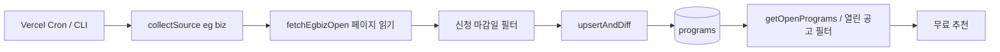

# 딱지원핏 공고 수집 RCA — 2026-09-17

## 결론과 조사 범위

**운영에서 관측한 실패와 로컬에서 입증한 데이터 결함을 구분한다.** 사용자에게서 특정 화면 증상·시각·요청 ID는 아직 전달받지 못해, 최근 운영 오류에서 조사 대상을 골랐다.

- 운영 관측: `/api/cron/collect-programs`의 EGBIZ 소스에서 `TypeError: fetch failed` 오류 집계가 남아 있다. 당시 호출 단계와 중첩 원인이 없어 DNS·TCP·TLS·응답 본문·Supabase 연결 중 어느 단계인지는 **미확정**이다.
- 로컬 재현으로 확정: 후속 페이지가 실패해도 수집기가 부분 배열을 성공 반환한다. 저장기는 그 배열을 전체 목록으로 해석해 못 읽은 기존 공고에 `closed_at`을 기록한다.
- 추가 실측: EGBIZ가 표시한 총계는 43이지만, 안내된 5페이지에서 고유 공고 ID 50개가 반환됐다. 지원 대상 필터 후 49개다. **표시 총계와 HTTP 성공만으로 전체 수집을 증명할 수 없다.**
- 수정 상태: 격리 작업본의 코드·테스트·진단 로그 구현 완료. **프로덕션 미배포, 운영 DB 변경 없음, 알림 서비스 등록 없음.** 운영 장애의 최종 RCA는 당시 상세 로그 또는 재발 시 새 단계 로그가 확보될 때 닫는다.

작업본: `/Users/jinjoopwer/ddakfit-operations-20260917`. 원본: `/Users/jinjoopwer/project/20260614_정부지원사업도우미`. 조사 시작 시 수집기·저장기·cron 파일은 두 경로에서 같았다. Vercel 배포 식별은 확인했지만, 배포 번들의 모든 파일을 내려받아 원본과 대조한 것은 아니다.

## 관측 근거와 한계

| 근거 | 관측 결과 | 해석 한계 |
|---|---|---|
| Vercel 현재 도메인 조회 | Production `dpl_9GsN1trKqwZB5jMMQWicB1NRxQDk`, READY, `ddakfit.bccconsulting.kr` 별칭 연결 | READY는 개별 기능 정상 보장이 아님 |
| 2026-09-17 10:29 KST health | 200, `ok:true` | 의존 서비스 없는 liveness이므로 DB/Auth/AI/결제 상태 미검증 |
| 최근 24시간 오류 집계 | 조회된 오류 없음, 상태 집계 200 1건 | 조회 데이터가 적다. 전체 무장애·모든 고객 정상이라고 단정 불가 |
| 7일 오류 집계 | EGBIZ `fetch failed` 그룹 1개, 도구 count=1, last=09-12 02:02 UTC(11:02 KST) | first=09-05는 조회 창 밖이다. 그룹의 생애 메타데이터일 수 있어 count를 기간 내 실제 장애 횟수로 단정하지 않음 |
| 동일 배포의 7일 상세 로그 | 반환 없음, 도구가 보존기간 초과 가능성을 안내 | 상세 로그가 없다는 사실이 과거 오류 부재를 뜻하지 않음 |
| 로컬 네트워크 최초 요청 | 샌드박스에서 ENOTFOUND | 샌드박스 결과는 프로덕션 DNS 장애 증거가 아님 |
| 허용된 로컬 네트워크 재검사 | 공개 목록 200, 약 1.2초 | 현재 시점·로컬 네트워크의 결과이며 Vercel iad1에서의 당시 경로 재현은 아님 |
| 실제 함수 읽기 검증 | 2026-09-17 01:49:18 UTC, 약 3.6초, 필터 후 49개, DB 쓰기 0 | 전체 7개 소스 배치 및 운영 DB 통합 실행은 아님 |

Vercel 오류는 연결된 Vercel 도구의 읽기 조회로 확인했다. 원문 고객 데이터·주문·인증키·서비스키는 조회하지 않았다. 공개 HTML 전체는 임시 폴더에만 두고 저장소에는 수치와 합성 테스트만 기록한다.

## 실패 가설 → 검증

| 가설 | 재현/반증 방법 | 현재 판정 |
|---|---|---|
| H1 외부 EGBIZ DNS/TCP/TLS/일시 단절 | 동일 요청의 `cause.code`, 페이지, 시각, Vercel 지역 확인 | 당시 원인 미확정. 현재 로컬 요청 정상 |
| H2 EGBIZ 4xx/5xx 또는 지연 | 상태코드·본문 읽기 단계·timeout 분리 | 당시 미확정. 합성 503/timeout/body 실패는 테스트함 |
| H3 HTML·페이지 수 변경 | 두 목록 경계, 표시 총계, 페이지별 ID·페이지 입력값 비교 | 표시 총계 불일치 실제 확인. 과거 fetch 오류 원인이라고 볼 수는 없음 |
| H4 DB 쓰기 실패 | 수집 완료 시각과 persist 시작/실패 로그 분리 | 기존 로그로 구분 불가. 새 로그 및 DB 실패 테스트 추가 |
| H5 부분 수집이 기존 공고 종료로 번짐 | 1페이지 성공, 2페이지 ECONNRESET, 기존 A/B 활성 행 | 로컬에서 확정. 수정 전 B의 `closed_at`이 실행 시각으로 변경됨 |
| H6 실행 제한·중복 스케줄 | 소스별 걸린 시간, 시작 후 종료 로그 누락, 두 실행기 상태 조사 | 코드상 위험. 실제 Vercel/GitHub 실행 중복은 미확인 |

## 호출 경로와 상태 변화

### 수정 전 재현

1. 가짜 DB: 공고 A와 B 모두 `closed_at=null`, `last_seen_at`은 전날.
2. 1페이지에 A를 반환하고, B가 있을 2페이지에 `ECONNRESET`을 주입.
3. `fetchEgbizOpen`은 실패를 console에만 쓰고 `[A]`로 정상 종료.
4. `collectSource`는 `[A]`를 저장기로 전달.
5. `upsertAndDiff`가 A를 갱신하고, 같은 소스의 미관측 B를 종료.
6. 사용자 조회는 `closed_at IS NULL`만 읽으므로 B가 추천에서 제외될 수 있음.

실제 수집기와 실제 저장 함수를 실행하고 네트워크·DB I/O만 가짜로 대체했다. 수정 전 최초 검사 6개 중 정상/첫 페이지 실패 2개는 통과했고, 후속 페이지 실패·HTML 변경·상한 잘림 관련 4개는 실패했다. 이 결과는 합성 데이터 재현이며 실제 고객 영향 수치가 아니다.

### Root Cause

`Program[]`에는 수집 범위가 완전한지 표시할 수 없다. 수집기는 실패를 삼켜 성공처럼 반환하고, 저장기는 “관측하지 못함”을 “종료됨”으로 바꿨다. HTTP 요청 성공, 빈 배열 방어, 소스 간 `allSettled` 격리만으로는 이 의미 차이를 막지 못했다.

탐지가 늦어지는 이유도 있었다. cron은 부분 실패에도 HTTP 200을 반환하며, 기존 에러 문자열에는 `collect`와 `persist`, 페이지, 중첩 네트워크 코드가 없었다. HTTP 상태만 보는 확인은 이 실패를 놓친다.

## 임시 대응과 영구 수정

| 구분 | 처리 | 상태 |
|---|---|---|
| 즉시 피해 제한 | EGBIZ를 비완전 수집 소스로 지정해 저장기에서 누락 행 종료를 차단. 기존 bojo 보호 유지 | 로컬 구현 |
| 실패 전파 | 첫/후속 페이지·본문 읽기·HTML 실패를 소스 실패로 전파하여 부분 배열이 저장기로 넘어가지 않음 | 로컬 구현 |
| 실행 경계 | EGBIZ 전체 35초, 개별 읽기 최대 15초, 최대 20페이지. 남은 시간 공유. 상한 초과는 실패 | 로컬 구현 |
| 응답 검증 | 목록 경계·숫자 총계·고유 ID 확인. 표시 총계보다 적으면 실패, 더 많으면 수치 경고 후 유효 공고 갱신. 어느 경우에도 EGBIZ 누락 종료는 금지 | 로컬 구현 |
| 운영 추적 | cron/CLI 공통 실행기, runId, 소스/단계, 시간, 성공·실패·빈 결과, 제한된 원인 코드 | 로컬 구현 |
| 장기 수집 계약 | 명시적 `{items, coverage, reason, cursor}`와 staging 실행 기록을 도입하고 검증된 스냅샷에만 종료 권한 부여 | 후속 설계 |

재시도 횟수만 늘리거나 함수 제한만 올리지 않았다. 당시 오류가 일시 장애인지 입증되지 않았고, 재시도는 부분 목록을 전체로 오인하는 문제를 해결하지 않는다. 필요하면 **단일 소스 읽기**에서 일시 오류만 제한 재시도하는 정책을 별도로 검증한다. DB 변경을 포함한 전체 배치를 무조건 재시도하지 않는다.

EGBIZ의 누락 종료 방지는 임시 피해 제한인 동시에, 신뢰할 만한 전체 수집 계약이 생길 때까지 유지해야 하는 저장 불변조건이다. 공고가 원문에서 삭제됐지만 마감일이 없으면 기존 행이 오래 남을 수 있다. 이는 놓친 공고를 자동으로 종료시키지 않기 위한 선택이며, 원문 확인에 따른 개별 종료·출처별 신선도 표시가 후속 작업이다.

## 계약 유지와 변경 범위

- URL·GET 인증·HTTP 200·응답 `{ok, runAt, summaries, failures}` 구조 유지. 장애 시 `ok:false`를 확인해야 한다.
- 잘못된 cron 인증은 401이며 수집/저장 실행 없음.
- CLI는 실패가 있으면 종료 코드 1. 7소스 레지스트리, 예약 주기, DB 스키마·RLS·환경변수·상품·인증 흐름은 변경하지 않음.
- 의도한 동작 변경: EGBIZ `closed`는 누락을 근거로 증가하지 않음. 다른 기존 완전 수집 소스의 종료 동작 및 bojo 보호는 회귀 검사로 보존.
- 로그 형식은 구조화된 JSON으로 변경. 종전 문자열 검색을 사용하는 운영 쿼리는 새 event에 맞춰야 한다.

수정 파일: [수집기](../../lib/data/egbiz.ts), [저장 보호](../../lib/supabase/programs.ts), [공통 실행기](../../lib/data/collectionRun.ts), [오류 분류](../../lib/data/collectionError.ts), [cron](../../app/api/cron/collect-programs/route.ts), [CLI](../../scripts/collect-programs.mts).

## 로그·메트릭·알림 설계

**아래 알림 조건은 설계이며 외부 서비스에 등록하지 않았다.** 로그 코드는 후보 빌드에만 있으며 운영에서는 배포 후부터 생성된다.

### 구현한 이벤트

| 이벤트 | 의미/필드 |
|---|---|
| `collection_started` | runId, runAt, sourceCount |
| `collection_source_started` | source, stage=collect |
| `collection_source_persisting` | source, stage=persist, collected, durationMs |
| `collection_source_finished` | source, outcome=success/empty, seen/new/closed/deadlineChanged, durationMs |
| `collection_source_failed` | source, stage, durationMs, errorCode, page/httpStatus/networkCode/causeName(있을 때) |
| `collection_finished` | success/partial_failure, failureCount, durationMs |
| `collection_count_mismatch` | EGBIZ expected/observed. 수집기 자체 경고이므로 runId 대신 플랫폼의 동일 호출 로그로 상관 분석 |

원시 error.message·stack·요청 URL·헤더·응답 본문은 새 진단 로그에 넣지 않는다. `ECONNRESET`, `ENOTFOUND`, `UND_ERR_CONNECT_TIMEOUT` 등 허용 목록의 코드만 남긴다. 기존 인증된 cron 응답의 에러 문자열 계약은 유지한다.

### 로그에서 집계할 메트릭

| 메트릭 | 산출 | 용도 |
|---|---|---|
| collection_runs_total | source별 finished/failed 수, outcome 구분 | 소스 단위 성공률 |
| collection_duration_ms | 종료 이벤트 durationMs 분포 | 지연 증가·시간 제한 위험 |
| collection_last_success_at | source_finished outcome=success의 마지막 runAt | 데이터 신선도. 단순 last_seen_at 최대값은 완전 성공 증거가 아님 |
| collection_seen / closed | 소스별 완료 summary | 급격한 누락·예상치 못한 종료 |
| collection_error_total | source·stage·errorCode별 failed 수 | 외부/파서/저장 실패 분리 |
| collection_missing_finish | 시작 후 제한 시간 내 종료 없음 | 강제 종료·스케줄 실패 |

runId는 로그 상관키로만 쓰고 메트릭 라벨에 넣지 않는다. 사용자가 없는 시간에도 수집 장애를 잡을 수 있도록 요청 수가 아닌 예약 실행과 신선도를 기준으로 한다.

### 제안 알림 기준

| 수준 | 조건 | 첫 행동 / 해제 |
|---|---|---|
| 경고 | 한 소스 실패 1회 또는 count mismatch 1회 | 같은 runId의 stage/code 확인. 중복 알림은 source+code로 1시간 묶기 |
| 우선 대응 | 동일 소스 2회 연속 실패, 또는 마지막 성공이 30시간 초과 | 원문 읽기와 저장 단계 분리 검사. 정상 완료 2회 후 해제 |
| 긴급 데이터 보호 | EGBIZ/bojo의 closed > 0 | 종료 작업 보류, 실제 실행 코드·DB 변경 이력 대조. 재수집/전체 복구부터 하지 않음 |
| 실행 누락 | Vercel 시작 후 70초 내 finished 없음, 또는 하루 예약 이후 2시간 내 started 없음 | 함수 종료 로그·실행기 상태·인증 확인 |
| 출처 전체 장애 | 모든 소스 실패 1회 | DB/실행 환경 등 공통 의존성 우선 확인 |

Vercel 설정은 UTC 02:00(한국 11:00) 매일, GitHub workflow 파일은 3시간마다다. GitHub 스케줄이 실제 활성인지 이번에 확인하지 않았으므로 신선도 초기값은 하루 주기를 기준으로 제안했다. 실행 주체와 정상 지연을 확정하면 임계값을 조정한다. 신규 알림은 운영자 승인된 수신 경로에 등록하고, 가짜 경보와 해제까지 검증한 뒤 활성으로 표시한다.

운영 재발 시: grouped errors 조회 → 해당 배포·짧은 시간 창의 상세 로그 → runId → source → 마지막 stage → page/status/networkCode 순서로 좁힌다. `collect` 실패는 원문 요청, `persist` 실패는 DB 조회/쓰기 경로를 확인한다. read-only `/api/health`로 cron을 대체하지 않는다. 인증된 cron GET은 DB 쓰기를 하므로 상태 점검용으로 실행하지 않는다.

## 회귀·엣지 케이스 검증

`npm run test:collection` — **24/24 통과**. 실제 수집/저장/cron 코드를 호출하고 fetch·Supabase I/O·clock만 대체한다.

- 첫/후속 페이지 fetch 실패, HTTP 503, body 읽기 실패, timeout, 전체 실행 예산 초과.
- 200 유지보수 HTML, 후속 페이지 구조 변경, 숫자 총계 변화, 중복으로 인한 누락, 페이지 상한/링크 상한.
- 정상 다중 페이지, 실제 사이트처럼 표시 건수보다 많은 응답, 정상 0건, 대행사 모집 제외.
- 부분 배열을 저장기에 직접 넣어도 EGBIZ 기존 행 보존.
- DB 실패는 persist로 기록, 다른 소스 계속 실행, 인증 실패 시 I/O 없음.
- cron 응답 필드·HTTP 코드, runId 상관관계, 로그 비밀 문자열 제외, 다른 소스 종료 계약·bojo 보호.

추가 검증: 기존 제품 guard(DOCX/PPTX/PDF 포함), TypeScript를 포함한 production build, 변경 파일 ESLint 통과. 정적 의존성 검사에서 순환/경계 위반/미해결 import 없음. 실제 EGBIZ 읽기 함수로 49개 반환 확인; DB는 읽거나 쓰지 않음.

## 배포·복구·남은 확인

1. 현재 작업본은 이전 관리자 MVP·리팩터링 변경을 함께 포함한다. 배포 후보 전체를 검토하거나 이번 수집 수정 파일만 운영 기준 별도 후보에 옮겨 검증한다.
2. Preview에서 테스트 DB로 공고 A/B 실패 재현, 성공 갱신, EGBIZ closed=0, 다른 소스 동작, 새 로그를 확인한다.
3. 승인된 운영 배포 후 배포 ID/별칭을 확인하고 다음 예약 실행의 모든 소스 시작·종료와 DB 신선도를 대조한다. health 200만으로 완료 처리하지 않는다.
4. 과거 오종료 복구는 **이번 수정과 별개**다. `source`, `closed_at`, `last_seen_at`, 공고별 마감일과 원문 증거를 읽기 대조해 대상 목록을 확정한다. 승인된 대상만 복구하고 전/후 상태를 기록한다. 기존 upsert는 이미 닫힌 행을 자동 재개하지 않으므로 단순 재실행을 복구로 취급하지 않는다.
5. 롤백 시에도 EGBIZ 누락 종료 보호는 유지한다. 이전 취약 배포로 전체 롤백하면 이 결함이 돌아오므로, 보호만 포함한 최소 후보를 별도로 준비한다.
6. 원래의 09-12 `fetch failed` 하위 원인, 실제 영향 공고 수/고객 수, 실행기 중복, 다른 수집원의 부분 응답 처리, 스냅샷 동시 실행/DB 트랜잭션 문제는 미확인·후속 조사로 남긴다.

서비스 기능 전체 정상, 실제 운영 데이터 복구, 원래 네트워크 장애 해결, 자동 알림 활성화를 이번 결과로 주장하지 않는다.

참고: [Vercel Observability](https://vercel.com/docs/observability), [Supabase update/filter](https://supabase.com/docs/reference/javascript/update). 설치된 Next.js 16.3.4 route-handler 문서와 Supabase changelog도 확인했으며, 이번 변경은 SDK API·스키마 변경 없이 저장 정책을 제한한다.
