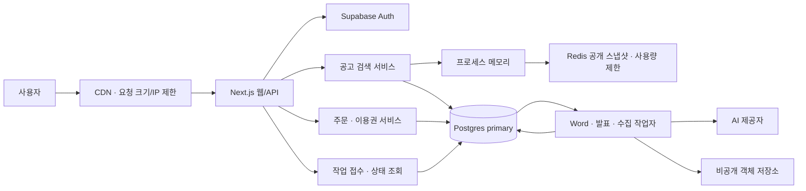

# 딱지원핏 100배 용량 설계

2026-09-17. 사용자 선택: **측정값 없음 — 가정과 검증 기준부터 설계**.

## 범위와 현재 상태

현재는 대규모 부하가 관측된 서비스가 아니다. 운영 로그 24시간 조회는 cron·health·embed 등 소수 항목만 보여 실제 사용자 RPS·동시 사용자·DB 규모를 산출할 근거로 부족하다. 이전 문서의 활성 공고 916건도 과거 스냅샷이지 현재 실측값이 아니다.

따라서 아래 수치는 용량 시나리오다. **100배 내구성이 검증됐다는 뜻이 아니다.** 기존 운영을 유지하며 Next.js 내부 서비스 경계를 먼저 정리하고, 긴 작업을 별도 실행기로 옮기는 단계적 구조를 선택했다.

| 구분 | 이번 결과 |
|---|---|
| 기존 경로에 연결 | 공개 공고 캐시 선택 경로(`PROGRAM_CACHE_ENABLED=on`일 때), Redis 실패/SDK timeout 시 503으로 거절하는 사용량 제한 응답 |
| 실행 가능한 핵심 코드 | Redis 캐시 잠금/발행, Postgres 작업 큐·슬롯·임대·토큰 검증·재시도/실패 보관, RPC 어댑터와 작업자 함수 |
| 실제 로컬 검증 | Redis·Postgres 통합 검사, 작업자/사용량 제한 검사, 합성 공고 캐시 1·10·100회/초 실험 |
| 설계 단계 | 결제 원장 Postgres 이전, 유료 API의 큐 전환, 소유자 인증을 포함한 작업 API/UI, 실제 AI·파일 처리 어댑터, 공개 공고 10만 건 후보 검색, 클라우드 작업자 배포/자동 증설 |
| 운영 상태 | 배포·환경변수·운영 DB/인덱스·외부 알림을 변경하지 않음. 캐시는 기본 비활성. 큐 SQL은 로컬 테스트 DB에만 적용 |

## 1. 가정·용량·지연시간

| 항목 | 비교 기준 가정 | 100배 시나리오 |
|---|---:|---:|
| 방문자/일 | 1,000 | 100,000 |
| API/방문자 | 10 | 10 |
| API/일 | 10,000 | 1,000,000 |
| 평균 API/초 | 0.116 | 11.6 |
| 피크 API/초 | 1 | 100, 별도 300/초·5분 과부하 시험 |
| 논리적 읽기:쓰기 | 90:10 | 읽기 900,000/일, 쓰기 100,000/일 |
| 문서 작업/일 | 10 | 1,000 |
| 사용자 | 1,000 | 100,000 |
| 공고 행 | 1,000 | 100,000 |
| 문서 결과 평균 크기 | 2 MB | 월 60 GB 추가, 90일 보관이면 약 180 GB |

캐시 적중·통계 배치·작업 상태 폴링 때문에 HTTP 요청 비율과 실제 DB 쿼리 비율은 다르다. 읽기:쓰기는 설계 입력이지 실측 DB 비율이 아니다. 원본 업로드·버전·백업·로그·인덱스 공간은 위 파일 용량에 추가한다. 공고 1행 2 KB 가정이면 원문 행 약 200 MB이며 인덱스/버전/TOAST 여유까지 1 GB부터 예산을 잡고 실제 행 폭을 측정한다.

| 경로 | 제안 목표 | 일관성 |
|---|---|---|
| 공개 공고 캐시 읽기 | warm p95 200ms 이하 | 정상 시 DB 스냅샷 갱신 지연 최대 약 60초, 장애 시 마지막 값 최대 5분 |
| 로그인 후 규칙 추천 | p95 800ms 이하 | 인증은 매 요청 검증, 공고만 지연 허용 |
| 새 작업 접수 | p95 500ms 이하, 성공 시 202 | 주문/이용권/작업 생성의 트랜잭션 확정 후 응답 |
| 문서 작업 대기 | p95 120초 이하 | 같은 요청 키는 같은 작업 ID |
| 문서 작업 완료 | 접수부터 p95 5분 이하 | 최종 결과 포인터는 유효한 실행 토큰만 확정 |
| 주문·권한 조회/변경 | p95 500ms 이하 | primary에서 읽기, 캐시로 결제/취소 여부 판정하지 않음 |

목표는 아직 서비스 수준 약속이 아니다. 실측 후 조정한다. 공고 캐시의 60초는 **DB에 들어온 이후** 기준이며, 원문 수집이 하루 주기인 지연을 숨기지 않는다.

### 작업자 산정

문서 작업 평균 실행시간을 120초, 피크가 일평균의 10배라고 가정한다.

- 평균 유입 `1,000 / 86,400 = 0.0116 작업/초`.
- 피크 유입 `0.116 작업/초`.
- 필요한 동시 실행 `0.116 × 120 = 13.9개`.
- 가동률을 70% 안쪽으로 계획하면 `ceil(13.9 / 0.7) = 20 슬롯`.
- 20슬롯 처리능력은 이 가정에서 최대 600작업/시간. 실제 긴 꼬리 지연·재시도·파일 렌더링은 별도 측정한다.
- Word 큐는 실행+대기 합계 40개까지만 받는다. 20개 실행/20개 대기일 때 대략 120초 대기에 해당한다. 대기열을 무한히 쌓아 접수 성공률만 높이지 않는다.

작업당 순차 AI 호출 5회, 입력 50,000/출력 10,000토큰을 가정하면 피크에 약 35요청/분, 입력 348,000/출력 69,600토큰/분이 필요하다. 이는 특정 모델의 승인된 쿼터가 아니다. 제공자별 RPM/TPM·실측 실행시간·예산 가운데 가장 작은 한도가 슬롯 수를 결정한다. 기존 Word 주문 원가 상한 4,500원을 적용하면 1,000건/일의 상한 합계만도 450만원/일이다. 실제 지출 예상이 아니라 전역 예산 제한이 추가로 필요하다는 계산이다.

## 2. 서비스 경계

첫 단계는 한 저장소의 모듈 구조를 유지한다. 공고, 주문/권한, 작업, 파일, 운영지표를 함수·테이블 소유권으로 분리한다. 웹과 작업자의 배포/자원만 나눈다. 네트워크 서비스 여러 개로 즉시 쪼개면 인증 전달·분산 트랜잭션·배포 조합이 늘어나므로, 독립적인 증설/장애/조직 소유권이 필요해질 때 분리한다.

| 경계 | 소유 데이터와 권한 |
|---|---|
| 공고 | 수집 원문 참조, 공고 정규화, 공개 조회/후보 검색. 사용자 문서 접근 없음 |
| 주문/이용권 | 외부 주문 ID, 결제 상태, 계정 연결, 사용 공고, 취소 버전. 권한의 유일한 변경 주체 |
| 작업 | 소유자, 요청 키, 입력 참조, 실행 상태, 시도 횟수, 임대, 결과 참조. 결제 상태를 자체 추정하지 않음 |
| 파일 | 비공개 입력/결과, 해시, 버전, 보관기간, 짧은 다운로드 URL. 파일 본문을 큐/Redis에 넣지 않음 |
| 운영 | 매출/전환/작업 신선도 집계. 보고용 지연은 허용하되 결제 권한 판단에 사용하지 않음 |

## 3. 저장소·캐시·일관성 선택

| 선택 | 이점 | 비용/주의점·예상 병목 |
|---|---|---|
| Postgres에 주문/이용권/작업 정본 | 유일키·행 잠금·트랜잭션으로 중복 접수와 상한 검사 가능 | primary 쓰기 병목, 관리형 장애조치/복구 검증 필요. 현재 Redis 주문 원장은 아직 이전하지 않음 |
| 공고 캐시 L1 + Redis L2 | 같은 공고 전체를 매 요청 DB에서 읽지 않음. L1에서 반복 Redis 전송도 감소 | 인스턴스마다 메모리 복제, 최대 60초 지연. 대형 JSON 복사·네트워크 비용이 남음 |
| 캐시 임대와 조건부 발행 | 동시 만료 시 한 작업자만 갱신, 만료된 소유자의 늦은 덮어쓰기 차단 | Redis 가용성 의존. Redis 장애+마지막 값 없음이면 원본 DB로 무제한 우회하지 않음 |
| 공고 partial index | `closed_at IS NULL` 조회와 마감일 정렬 지원 | 읽기 패턴/데이터 분포에 따라 효과 다름. 실제 EXPLAIN 후 적용 |
| 비공개 객체 저장소 | 큰 파일을 DB/큐에서 분리, 파일 비용·확장 독립 | 업로드 후 DB 확정 실패 시 고아 파일. lifecycle/해시 대조 청소 필요 |
| 단일 쓰기 지역 | 결제·작업 순서와 읽기 일관성을 단순화 | 먼 지역 사용자 지연. 멀티리전 쓰기 충돌 처리 비용을 우선 피함 |

현재 공고 함수는 여전히 **최대 3,000행을 읽는다**. 이번 캐시는 이 기존 검색 계약을 유지한다. 공고 10만 건의 전체 검색을 지원했다고 해석하면 안 된다. 그 단계에서는 정규화된 지역·지원유형·업력 후보 컬럼과 인덱스로 DB에서 후보 200~500개를 뽑은 뒤 기존 규칙을 적용하고, 기존 결과 집합과 대조해야 한다. 페이지마다 전체 10만 행을 Redis에서 받아 필터링하는 구조로 확장하지 않는다. [후보 인덱스 SQL](../../infra/scale/catalog-index.sql)은 작성만 했고 운영에는 적용하지 않았다.

### 구현한 캐시 정책

- `PROGRAM_CACHE_ENABLED=on`일 때만 [catalogCache](../../lib/data/catalogCache.ts) 사용. 기본은 기존 조회다.
- 공개 `Program[]`만 저장. 사용자별 추천·사업 설명·세션·주문·이용권은 캐시하지 않음.
- 신선도 60초, 마지막 정상 값 최대 5분, DB 로드 최대 2초, 잠금 3초.
- 한 프로세스의 동시 요청은 같은 진행 중 Promise를 공유. 서로 다른 인스턴스는 Redis `SET NX PX`와 Lua의 토큰 비교로 조정.
- 오래된 값이 있으면 갱신 실패에도 정해진 기한까지만 제공. 값이 없는 동시 갱신 대기는 최대 약 2.1초에 Redis 요청 지연이 추가될 수 있다.
- Redis 요청 자체는 750ms로 제한하고 자동 재시도를 끔. 실패 후 프로세스당 1초 재시도 억제.
- 반환 배열은 복제하여 한 요청이 다른 요청의 캐시 값을 변경하지 못하도록 함. 합성 3,000행은 약 1.69MB이며 복제 비용도 부하 실험에 포함.
- 마지막 값도 없으면 기존 상위 함수의 `usingSample=true` 경로로 떨어진다. 이 fallback 발생률을 정상 성공과 분리해 관측한다.
- 현재 수집기는 캐시를 직접 무효화하지 않는다. 즉시 반영이 필요하면 수집 완료 버전 키를 도입해야 한다.

## 4. 큐·비동기 처리·동시성

[jobs.sql](../../infra/scale/jobs.sql)은 순수 Postgres 테이블/함수다. 설치된 확장에 의존하지 않고 소규모 durable queue를 먼저 구현했다. `SKIP LOCKED`로 작업을 선택하며, 슬롯/대기 상한 판정은 짧은 큐 행 잠금으로 직렬화한다. 이 패턴은 작업자 큐에 적합하지만 큐 행 잠금 자체가 아주 높은 접수율에서는 병목이 된다. [Postgres locking 문서](https://www.postgresql.org/docs/current/sql-select.html#SQL-FOR-UPDATE-SHARE)

큐별 기본값:

| 큐 | 실행 상한 | 실행+대기 상한 | 계정당 진행 작업 | 최대 시도 | 임대/시도 실행 상한 |
|---|---:|---:|---:|---:|---|
| word | 20 | 40 | 3 | 3 | 60초/300초 |
| presentation | 10 | 20 | 3 | 3 | 60초/300초 |
| collection | 2 | 20 | 3 | 3 | 60초/300초 |

1. 서버가 Google 사용자·상품·이용권·요청 크기를 확인한다. `owner_id`는 요청 본문에서 신뢰하지 않고 검증한 로그인 ID로 설정한다.
2. 미래 유료 접수 트랜잭션은 이용권 행 잠금 → 사용 공고/주문 버전 확인 → 원가 예약 → 작업 생성 순서다. **현재 큐 함수만으로 이 결제 트랜잭션이 구현되지는 않는다.**
3. `(owner_id, queue, idempotency_key)` 유일키. 같은 키/같은 JSON 입력은 같은 작업, 같은 키/다른 입력은 충돌. 키는 클릭 재시도 때 재사용한다.
4. 작업자는 짧은 트랜잭션으로 작업을 가져온 뒤 DB 연결/잠금을 해제하고 AI를 호출한다. 네트워크 호출 동안 DB 트랜잭션을 열지 않는다.
5. `lease_token`과 만료 시각으로 소유권을 검사한다. 작업자 함수는 기본 10초마다 임대를 갱신하고, 실패하면 AbortSignal로 처리를 중단한다.
6. 결과는 `job-id/attempt-token/...`처럼 덮어쓰지 않는 경로로 업로드하고 해시를 검증한다. DB 결과 포인터 확정은 유효한 토큰/임대에만 허용한다.
7. 일시 오류로 분류한 경우에만 5초, 10초…최대 300초 후 재시도하며 시도 상한을 넘으면 `dead`로 보관한다. 임대가 만료된 마지막 시도 역시 다음 claim에서 dead 처리한다.

**전달/실행은 at-least-once다.** 임대가 끝난 작업자가 실제로 멈추기 전에 새 작업자가 실행될 수 있다. SQL은 늦은 결과 확정을 막지만 외부 AI의 중복 실행/과금을 제거하지 못한다. 처리기는 AbortSignal을 지켜야 하며, 원가 예약의 불확정 상태·제공자 요청 ID·최종 결과 저장을 대조해야 한다. 원가 집계가 불명인 예약을 무조건 환급하고 재시도하면 상한이 깨질 수 있다.

공통 큐를 공유하더라도 Word·발표·수집의 슬롯은 분리한다. 전역 AI 제공자 한도는 두 AI 큐의 슬롯 합계/TPM을 함께 제한해야 한다. 제공자 429가 계속되면 해당 큐 접수를 제한하고, 새 모델로 조용히 바꿔 품질/가격 계약을 변경하지 않는다. pgmq 또는 별도 관리형 큐로 옮길 때도 작업 정본·중복 키·결과 토큰 검사와 주문 트랜잭션은 유지한다.

### 새 API 계약 제안 — 아직 라우트 미구현

- `POST /api/v2/jobs`: 인증·결제 확인, `Idempotency-Key`, `{kind, documentId, inputVersion}` → `202 {jobId,state}` 및 `Location`.
- 큐 포화/계정 한도는 `429 Retry-After`, 저장소 장애는 `503`, 같은 키의 입력 충돌은 `409`.
- `GET /api/v2/jobs/:id`: `owner_id`를 서버에서 확인, 다른 소유자는 404. 상태·시도 횟수·사용자용 오류·결과 참조 반환. 원시 제공자 오류/고객 원문 제외.
- 클라이언트는 2→5→10초 간격에 분산 지연을 넣어 확인하고, 탭이 숨겨지면 빈도를 줄인다. 응답이 오기 전에 연결이 끊겨도 같은 접수 키로 조회/재접수한다.
- 다운로드는 현재 권한을 다시 검사한 뒤 짧은 서명 URL을 발급한다. 인증 응답/문서는 CDN 공용 캐시에 넣지 않는다.

기존 동기 API/화면은 유지한다. [RpcJobStore와 작업자 함수](../../lib/scale/jobs.ts), [서버용 연결 팩토리](../../lib/scale/serverJobStore.ts)는 실행 가능한 구성요소지만, 실제 유료 생성 API와 브라우저의 작업 상태 화면은 후속 전환이 필요하다.

## 5. 사용량 제한과 장애 격리

기존 IP별 sliding window 숫자는 유지했다. 신규 사용자/강의장의 공용 IP에 대해서는 인증한 사용자 ID 기반 제한과 IP의 넓은 상한을 함께 적용하는 정책이 후속으로 필요하다. 임의 헤더/검증 전 JWT를 사용자 식별자로 신뢰하지 않는다.

이번에는 [사용량 제한기](../../lib/ratelimit.ts)의 **운영 설정 누락·Redis 오류·SDK timeout 허용 경로를 닫고**, 23개 호출 경로가 503과 Retry-After를 반환하도록 연결했다. 일반 한도 초과는 기존 429를 유지한다. SDK의 timeout이 `success:true`를 돌려줄 수 있는 점을 별도 검사했다. [Upstash timeout 설명](https://upstash.com/docs/redis/sdks/ratelimit-ts/features)

| 장애 | 격리·복구 선택 | 남는 비용 |
|---|---|---|
| Redis 느림/중단 | 750ms 후 중단. 오래된 공개 캐시만 기한 내 제공, 비용 경로는 503 | Redis 장애가 유료 요청 가용성을 낮춤. 지출 상한 우회보다 우선 |
| 공고 DB 읽기 중단 | 캐시 최대 5분, 이후 명시된 sample fallback | 신선도/검색 품질 저하를 별도 지표로 표시해야 함 |
| 특정 수집원 실패 | 지난 RCA의 소스 격리와 EGBIZ 누락 종료 보호 유지 | 전체 출처 최신성을 한 개 success로 표시하면 안 됨 |
| AI 제공자 느림/429 | 큐별 실행 상한, 시도 시간 제한, 제한 재시도 | 대기/거절 증가. 제공자 한도가 증설되지 않으면 서버만 늘려도 해결되지 않음 |
| 작업자 중단 | 임대 만료 후 재획득, 오래된 토큰의 결과 확정 금지 | 외부 실행 중복 가능성, 파일 고아/불확정 과금 대조 필요 |
| 파일 업로드 성공·DB 확정 실패 | 고유 경로 유지, 작업/파일 해시 대조 후 포인터 재확정 | 고아 파일 보관 비용. 즉시 삭제하면 복구 근거를 잃음 |
| Postgres 중단 | 새 주문/작업 확정 중단, 가짜 접수 성공을 반환하지 않음 | DB primary가 주문·큐의 공통 장애 지점 |

## 6. Single Point of Failure와 복구 목표

| 의존성 | 현재/제안 SPOF | 복구/완화 |
|---|---|---|
| Postgres primary | 작업·미래 주문 정본이 한 primary에 의존 | 관리형 복제/장애조치/PITR 활성 여부 확인, 백업 복원 훈련. 읽기 replica는 공고/통계에만 우선 사용 |
| Redis | 현재 이용권 원장과 rate limit까지 의존 | 캐시는 재생성 가능하지만 현재 결제 키는 그렇지 않음. 권한 원장 이전·백업/복원 검증을 우선 |
| Supabase Auth | 인증 서비스 실패 시 유료 접근 제한 | JWT/세션 정책과 제공자 장애 대응 분리. 만료/취소 권한을 임의 캐시해 통과시키지 않음 |
| AI 제공자/전역 쿼터 | 모델 장애·속도·토큰 한도 | 큐별 제한/제공자별 회로 차단 정책, 사전 승인된 대체 모델만 선택 |
| 결제 웹훅 | 이벤트 유실·중복·역순 | 외부 주문 ID/이벤트 ID 유일키, 허용 상태 전이, 취소한 주문과 현재 권한 주문 비교, 외부 원장 정기 대조 |
| 작업자 단일 인스턴스 | 한 작업자의 중단 | 최소 2개 작업자 인스턴스, 슬롯 합계는 DB에서 제한. CPU 파일 렌더러와 AI 대기 작업자 자원 분리 |
| DNS/CDN/한 지역 | 지역 장애와 전파 지연 | 재배포 가능한 설정/이미지, 복구 지역 read-only 준비. active-active 쓰기는 후속 과제 |

제안 복구 목표: 공개 조회 RTO 15분, 주문/작업 접수 RTO 30분, 내부 DB의 재해 RPO 5분 이하를 시작점으로 검토한다. 이는 현재 설정으로 검증된 수치가 아니다. 승인된 외부 결제는 결제 원장과 재대조해 복구하고, RPO 0을 보장한다고 표현하지 않는다.

복원 훈련은 빈 환경에 DB 백업 복원 → 주문 유일키/누락 대조 → 유효 임대가 없는 작업 재처리 → 결과 파일 해시 대조 → 제한된 사용자 검증 → 트래픽 전환 순서다. 큐 상태를 수동으로 모두 초기화하거나 AI 작업을 무조건 다시 실행하지 않는다.

## 7. 예상 병목과 확장 순서

1. **Auth 반복 호출:** 현재 여러 유료 경로에서 로그인/권한 검증이 중복될 수 있다. 요청 범위에서 검증한 사용자 객체를 전달하고, 사용자 간 공유 캐시는 사용하지 않는다.
2. **기존 이용권 GET→SET 경쟁:** `markCreditUsed` 등은 아직 원자적 공고 바인딩이 아니다. 큐 전환 전에 주문 버전과 함께 원자적 바인딩/접수 트랜잭션을 구현해야 한다.
3. **AI 처리량/가격:** 슬롯 수보다 RPM/TPM과 주문별·전역 예약 예산이 먼저 막힐 수 있다. 실제 청구 기록과 예약 정산을 측정한다.
4. **공고 전체 배열:** 3,000행 상한, JSON 복사·규칙 필터 비용이 남는다. 10만 행 단계에서는 후보 검색으로 전환한다.
5. **파일 렌더링 CPU/메모리:** PPT/PDF/이미지 생성은 별도 작업자에 제한된 동시성을 부여하고 최대 입력/페이지/해상도를 유지한다.
6. **큐 행 잠금·polling:** 큐별 claim/admission은 직렬 결정 구간이 있다. 이 설계의 문서 피크 약 0.116건/초에 먼저 적용하고, 수백 접수/초가 실제로 필요해지면 샤딩 또는 전용 큐를 검토한다. `SKIP LOCKED`만으로 무제한 확장된다고 보지 않는다.
7. **공통 DB 연결 수:** 웹은 PostgREST/RPC, 직접 연결 작업자는 작은 pool과 transaction pooling을 사용한다. 작업당 AI 대기시간 동안 연결을 점유하지 않는다. 현재 클라우드 pool 한도·지역은 별도 확인 대상이다.

## 8. 배포 단계와 통과 기준

| 단계 | 작업 | 다음 단계 조건 |
|---|---|---|
| 0 측정 | 요청·인증·DB·AI·렌더링 시간을 분리, DB 행/파일 용량·원가/쿼터 확인 | 최소 한 번의 실제 사용 피크와 소스별 실패/신선도 확보 |
| 1 보호 | 사용량 제한 수정, 캐시 Preview 활성, 지난 수집 보호 검증 | 정상/429/503 계약, 샘플 전환율, cold/warm 결과 집합 일치 |
| 2 durable job | 주문·이용권 원자 접수, 결과/비용 예약, v2 작업 API/UI, 실제 처리기 | 중복 클릭/응답 유실/프로세스 강제 종료/취소 중 실행/재시도/교차 계정 검사 |
| 3 용량 | 100k 공고 후보 검색, worker/DB/파일 부하 | 1→10→100 RPS 각 20분, 100 RPS 60분 지속, 300 RPS 5분 과부하 후 10분 내 회복 |
| 4 복구/운영 | 백업 복원, Redis/AI/DB 장애 주입, 제한적 운영 전환 | RTO/RPO 실측·경보 수신/해제·롤백 검증 후 공개 용량 약속 |

전체 부하 시험에서 정상 요청 p95, 예상 밖 5xx <1%, 원가 상한 위반 0, 다른 계정 결과 노출 0, 중복 결과 확정 0, 누락 종료 0을 검사한다. 의도한 429/503과 정상 처리 실패는 별도 집계하되, 모든 요청을 거절해 성능 목표를 통과시킬 수 없도록 성공 처리량/거절률도 함께 보고한다. 신규 상태 폴링 요청까지 부하에 포함한다.

유료 부하 시험은 합성 주문/사용자와 제공자 stub으로 먼저 수행하고, 실제 AI는 승인된 호출/비용 예산 내에서 따로 검증한다. 운영 도메인에 무승인 부하를 가하지 않는다.

## 9. 관측·경보

필수 필드: requestId/jobId, 배포 버전, 단계, 제공자/모델, 소요 시간, 성공/실패 코드, 재시도 횟수, 토큰 수/원가. 문서 원문·서명 URL·세션/결제 키는 제외한다. jobId는 로그 상관키로만 사용하고 메트릭 라벨에 넣지 않는다.

필수 지표: 경로별 성공 RPS/p95/p99, 429/503, Auth 호출 수, DB pool 대기, cache fresh/stale/miss/sample 비율, 원본 refresh 수, 큐별 대기 수/가장 오래 기다린 시간, 활성 임대/만료/죽은 작업, AI RPM/TPM/원가, 렌더링 RSS/시간.

초기 경보 제안: 큐 대기 p95 >120초 5분, 예기치 않은 5xx >1% 5분, rate-limit 저장소 실패 >1% 5분, dead 작업 발생, 캐시 sample 전환 발생, 전역 예산 80%/100%, 수집 신선도 >30시간. 외부 경보는 아직 등록하지 않았다. 임대/캐시 로그 계측의 상세한 운영 집계와 대시보드는 다음 배포 단계에 연결한다.

구체적인 로컬 실행과 실제 검사 결과는 [검증 문서](scale-verification.md), 실험 원수치는 [벤치마크 JSON](scale-benchmark.json)에 둔다.
