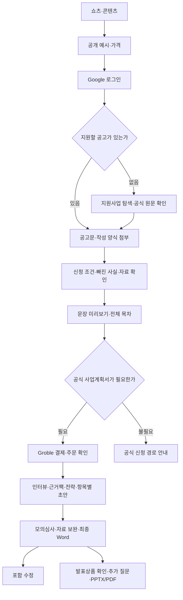
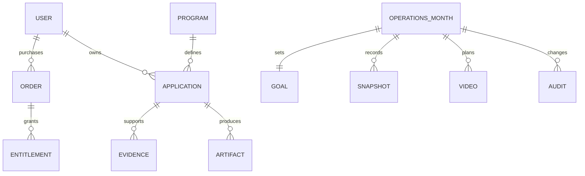

# 사용자 흐름과 시스템 설계

## 핵심 사용자 흐름



운영 흐름은 `관리자 로그인 → 월 선택 → 목표 확인 → 원본 대조 성과 입력 → 서버 검증 → 버전 비교 저장 → 목표 역산 → 다음 영상 결정`이다. 수치가 없으면 미확인으로 표시한다. 구매 권한과 운영 권한은 별개다.

## 도메인 모델

| 도메인              | 책임                                        | 주요 관계                                                       |
| ------------------- | ------------------------------------------- | --------------------------------------------------------------- |
| User                | 인증된 고객·관리자                          | 주문·신청 작업·운영 기록의 행위자                               |
| Program             | 공식 공고와 신청 양식·기간                  | 출처 하나에 여러 공고                                           |
| Application         | 한 사용자·공고·사업 아이템·양식의 작성 작업 | 답변·근거·문서와 연결. 기존 코드는 상태가 여러 저장 객체에 분산 |
| EvidencePack        | 주장·근거·확인 필요 상태                    | Application과 연결                                              |
| Order / Entitlement | 결제 근거와 사용 범위                       | 상품별 Word·발표 이용권. 결제 이벤트와 고객 재접속 구분         |
| Artifact / Revision | Word·발표 원본·검수·수정 횟수               | 원답변과 근거·목차의 digest에 연결                              |
| OperationsMonth     | 월 목표와 성과 기록의 저장 단위             | Goal 1개, Snapshot 여러 개, Video 여러 개, Audit 여러 개        |
| Goal                | 기간·매출·게시 목표·계산용 가격             | OperationsMonth에 종속                                          |
| Snapshot            | 특정 날짜까지의 누적 원본 대조값            | month + asOf가 논리 키                                          |
| Video               | 영상의 계획과 게시 후 반응                  | month + id가 논리 키. 단일 구매 귀속을 추정하지 않음            |



## 아키텍처

```mermaid
flowchart LR
  U[고객 브라우저] --> N[Next.js UI / Route Handlers]
  O[관리자 /operations] --> R[/api/operations]
  R --> A[기존 Google 사용자 서버 검증]
  A --> SA[Supabase Auth]
  R --> D[입력 검증·도메인 계산]
  D --> S[OperationsStore 인터페이스]
  S --> REDIS[Upstash Redis / 원자적 버전 저장]
  S --> LOCAL[개발 전용 로컬 파일]
  N --> SA
  N --> PG[Supabase 공고·CRM]
  N --> CACHE[기존 Redis 이용권·문서]
  N --> AI[AI 제공자]
  PAY[Groble 웹훅] --> N
  CRON[Vercel Cron] --> N
```

Next.js 모듈형 단일 서비스로 유지한다. 네트워크·데이터 접근은 서버 경로에서 처리한다. 도메인 모듈에는 HTTP·React·외부 DB 의존성을 넣지 않는다. 계산 코드는 같은 입력에 같은 결과를 내며 날짜를 인자로 주어 검증할 수 있다.

새 모듈의 저장소 선택은 운영 Redis와 개발 로컬 파일이다. `OperationsStore.read/compareAndSet` 계약을 유지하면 이후 Postgres 구현으로 교체할 수 있다. 개발 모드는 `NODE_ENV=development`, `OPS_LOCAL_MODE=on`, loopback 요청이 모두 맞아야 하며 운영 저장소를 읽지 않는다. 로컬 실행 명령은 127.0.0.1에만 바인딩한다.

## 기술 스택

| 영역      | 채택                                          | 이유                                           |
| --------- | --------------------------------------------- | ---------------------------------------------- |
| UI·API    | 기존 Next.js 16.3.4, React 19.2.4, TypeScript | 배포·로그인·문서 생성 경로 재사용              |
| 인증      | 기존 Supabase Auth / Google                   | 운영 계정 체계 유지; 서버 `/auth/v1/user` 확인 |
| 공고·CRM  | 기존 Supabase Postgres                        | 수집기·검색·CRM의 현재 원본 유지               |
| 운영 기록 | 기존 `@upstash/redis` 1.38.x                  | 기존 의존성으로 서버리스 지속 저장·Lua CAS     |
| 문서      | 기존 docx·pptxgenjs·pdf-lib·resvg             | 기존 Word/PPT/PDF 기능 유지                    |
| 검사      | Node 내장 test·assert, TypeScript, ESLint     | 새 테스트 프레임워크 추가 없이 도메인·API 검사 |
| 배포      | 기존 Vercel Node 런타임                       | 기존 서비스와 동일한 환경 및 복구 방식         |

이번 기능은 패키지를 추가하지 않았다. 설치 버전은 package-lock.json으로 고정한다. 새 프레임워크로 교체하지 않는다.

## 인증·권한

| 행위자             | 허용 범위                                          |
| ------------------ | -------------------------------------------------- |
| 비로그인 방문자    | 공개 랜딩·가격·약관. 운영 데이터 401               |
| Google 로그인 고객 | 기존 무료 확인과 본인 이용권 범위. 운영 데이터 403 |
| 서버 확인 관리자   | 월 목표·성과·영상 조회 및 변경                     |
| 결제 제공자        | 기존 웹훅 인증 경로로만 주문 기록                  |
| 개발 로컬 사용자   | 로컬 전용 기록. 프로덕션 모드에서는 우회 불가      |

UI 로그인만으로 권한을 판정하지 않는다. 모든 운영 API는 서버에서 사용자와 관리자를 재확인한다. 운영 권한은 서버 allowlist 또는 서버가 관리하는 app_metadata를 사용한다. 마스터 코드·쿼리 토큰으로 운영 API를 열지 않는다. 브라우저에는 service role·Redis token을 보내지 않는다. 응답은 `private, no-store`이며 변경 요청의 Origin을 검사한다.

## 프론트엔드 구조

```text
app/operations/page.tsx                  서버 진입·noindex·개발 모드 판단
app/operations/OperationsDashboard.tsx  기존 AuthGate·성과/목표/영상 입력
app/operations/operations.css          페이지 범위 반응형 스타일
app/api/operations/route.ts             실제 인증·저장소 어댑터 연결
lib/operations/domain.ts                타입·검증·날짜·금액·다음 행동
lib/operations/http.ts                  HTTP 계약·권한·본문 크기·오류
lib/operations/storage.ts               Upstash CAS / 개발 파일 영속화
tests/operations.test.ts                도메인·권한·실패·경합·지속성 검사
```

저장 실패 시 입력을 유지한다. 409일 때 자동으로 사용자 변경을 덮어쓰지 않고 새로 불러오도록 안내한다. 영상 URL은 https YouTube 주소만 허용한다. JSX 텍스트 렌더링을 사용하고 사용자 HTML을 삽입하지 않는다.

## 확장 순서

1. 실제 주문 금액·환불·이벤트 식별자의 공식 계약을 확정하고 멱등 주문 원장을 만든다.
2. YouTube/GA4를 읽기 전용으로 연결한다. 수집 시각·대상 기간·시간대·출처·중복 제거 키를 함께 저장한다.
3. 자동 집계와 수동 보정 데이터를 분리한다. 자동값에 수동값을 더하는 방식으로 중복 집계하지 않는다.
4. 신청 작업 ID를 도입해 분산된 답변·이용권·근거·문서를 연결한다. 기존 데이터 백필·이중 읽기·복구 후 전환한다.
5. 생성 작업이 서버리스 제한에 가까워지면 작업 상태·재시도 키·비용 예약을 가진 큐로 분리한다.

출처: https://nextjs.org/docs/app/getting-started/route-handlers · https://supabase.com/docs/reference/javascript/auth-getuser · https://upstash.com/docs/redis/sdks/ts/commands/scripts/eval (2026-09-17 확인). 설치된 Next.js 패키지의 문서도 대조했다. Supabase 변경 로그에서 이번 hosted Auth 사용에 해당하는 추가 변경은 발견하지 않았다.
